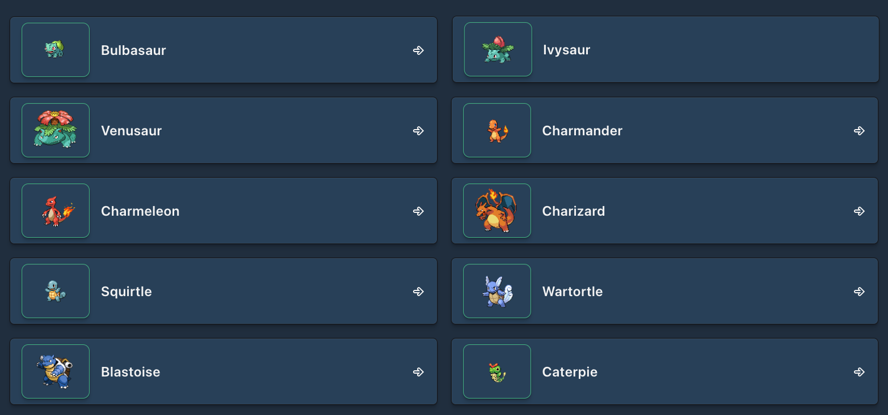

# BestUse Junior Software Developer test

<p align="center">
  
</p>

## 🖥️ Project

Project developed as a technical test for a Junior Software Developer position at BestUse Technology. The goal is to create a React app that consumes [PokéAPI](https://pokeapi.co/) to list and show Pokémon details.


## 🚀 Technologies

The following technologies were used to develop this project:
- Vite + React
- TailwindCSS  
- TypeScript
- Axios

## 🛠️ Installation

Use the package manager [npm](https://www.npmjs.com/) or [pnpm](https://pnpm.io/pt/) to install the project dependencies.

## 🐾 Steps
First download or clone the project folder from this GitHub repository. 

Then run the command to install the dependencies:
```bash
npm install
pnpm install
```

Lastly run the command to run the frontend application on your localhost:
```bash
npm run dev
pnpm run dev
```

## 📖 Usage
You can search a Pokémon by typing its name on the search field, or by simply navigating between pages. Once you click on a card, you will be prompted with the respective Pokémon image, name, type(s) and abilities.

## ✍🏻 Future recommended improvements 
- add a button to toggle between light and dark mode; 
- add a soft animation when opening/closing a modal;
- add a button to play the sound of a Pokémon; 

<!-- ### ✨ You also can check the project running [here]()! -->